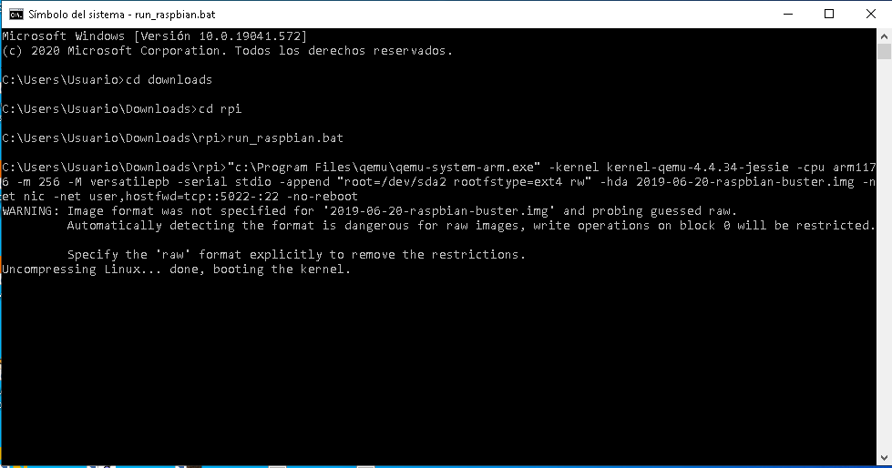

# 2.2-QEMU-de-RaspberryPI
#    Tecnológico Nacional de México
#   Instituto Tecnológico de Tijuana
 Subdirección Académica
 Departamento de Sistemas y Computación
 Ingeniería en Sistemas Computacionales
 Lenguajes de interfaz 

## Practica Bloque: 2.3  (REPOST) Elabora la QEMU de RaspberryPI virtual y corra sus programas de CPP.

 Rodriguez Martinez Emmanuel Arturo
 No.Control: 18212261
   
 Profesor:
 MC. René Solis Reyes
 
# Ejecutar QEMU
Primero tenemos que entrar a la aplicacion de cmd y dirigirnos a la carpeta donde se encuentra el QEMU y correrlo.



Al entrar tendras que esperar a que carge los recursos de la virtualizacion.


Al terminar de cargar entraras a el escritorio de Raspberry


Ya dentro tendremos que abrir la terminal, que se encuentra en la parte superior.


Dentro de la terminal tendremos que clonar el repositorio que se encuentran los programas, para posteriormente correrlos.


# Ejercicio 40
Calcular el area superficial de S de un prisma con dimensiones l, h, w. En este problema, l = 10, h = 4 yw = 5.2m.
```bash
// Ejercicio 40

#include <iostream>
using namespace std;

int main() 
{
	float l = 10, h = 4, w = 5.2;
	float S;
	cout << "l (largo):" << l << "\n";
	cout << "h (alto):" << h << "\n";
	cout << "w (ancho):" << w << "\n";
	S = l * h * w;
	cout << "El area superficial es de:" << S << "m." << endl;
    return 0;
}
```

# Ejercicio 82
Determinar la ecuación de la recta que pasa por los puntos (0, -2) y (-68, -15).
```bash
// Ejercicio 82

#include <iostream>
using namespace std;

int main() 
{
	float x1 = 0, x2 = -68, y1 = -2, y2 = -15;
	float m;
	cout << "x1:" << x1 << "\n";
	cout << "y1:" << y1 << "\n";
	cout << "x2:" << x2 << "\n";
	cout << "y2:" << y2 << "\n";
	m = (y2 - y1) / (x2 - x1);
	cout << "La ecuación es:" << m << "X - Y +" << ((m * x1) + y1) << endl;
    return 0;
}
```

# Ejercicio 83
Determinar la ecuación de la recta que pasa por los puntos (56,16) y (-40,1).
```bash
// Ejercicio 83

#include <iostream>
using namespace std;

int main () {
	float x1 = 56, y1 = 16, x2 = -40, y2 = 1;
	float m;
	cout << "x1:" << x1 << "\n";
	cout << "y1:" << y1 << "\n";
	cout << "x2:" << x2 << "\n";
	cout << "y2:" << y2 << "\n";
	m = (y2 - y1) / (x2 - x1);
	cout << "La ecuación es: " << m << "X - Y +" << ((m * x1) + y1) << endl;
    return 0;
}
```

# Ejercicio 84
Determinar la ecuación de la recta descrita por la pendiente 3 y el punto sobre la recta (8, -4)
```bash
// Ejercicio 84

#include <iostream>
using namespace std;

int main () {
	
	float x1 = 8, y1 = -4;
	float m = 3;
	cout << "x1:" << x1 << "\n";
	cout << "y1:" << y1 << "\n";
	cout << "pendiente:" << m << "\n";
	cout << "La ecuación es:" << m << "X - Y +" << ((m * x1) + y1) << endl;
    return 0;
}
```

# Ejercicio 85
Imprimir la pendiente de la recta con una intercepcion y de (0,10) y un punto (-3,0).
```bash
// Ejercicio 85

#include <iostream>
using namespace std;

int main () {
	
	float x1 = 0, y1 = 10, x2 = -3, y2 = 0;
	float m;
	cout << "x1:" << x1 << "\n";
	cout << "y1:" << y1 << "\n";
	cout << "x2:" << x2 << "\n";
	cout << "y2:" << y2 << "\n";
	m = (y2 - y1) / (x2 - x1); 
	cout << "La pendiente es:" << m << endl;
    return 0;
}
```


# Conclusion
Esta es una gran experiencia y nos ayudara para proximos proyectos, ya que la utilizacion de la programacion cpp es muy importante y ademas la retroalimentacion de la terminal nos ayuda y nos abre nuevos conocimientos que podemos implementar en futuros proyectos.
